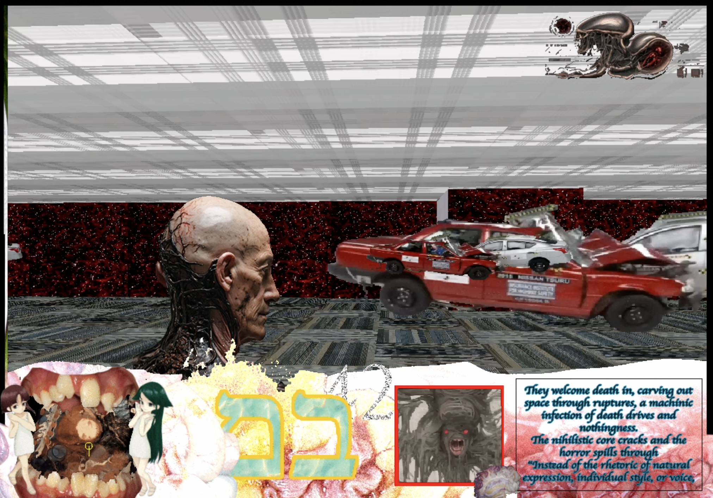

# Cub3d

Welcome to **Cub3d**, a 42 School project where you build a basic 3D game engine inspired by the classic game Wolfenstein 3D. The game is developed using ray-casting techniques to create a pseudo-3D environment. In this particular version, the project has been made compatible with Emscripten, allowing it to run directly in a web browser using WebAssembly (Wasm) and JavaScript.

## Project Overview

Cub3d is designed to give you a deeper understanding of how 3D rendering works by implementing a simple game engine from scratch. You will work with:

- **Ray-casting**: A technique to simulate a 3D perspective in a 2D map.
- **Graphics Rendering**: Managing textures, sprites, and movement to create an immersive environment.
- **Game Logic**: Implementing player movement, collision detection, and basic interactions.

### Emscripten Compatibility

In this version of Cub3d, the project has been modified to be compatible with Emscripten, a toolchain that compiles C and C++ code to WebAssembly. This allows the game to run in web browsers without needing any plugins.

#### Custom MLX42 Library

To achieve this, the **MLX42** library from [codam-coding-college/MLX42](https://github.com/codam-coding-college/MLX42) was modified. The modifications were necessary to ensure compatibility with Emscripten and to enable proper rendering in a browser environment.

You can try out the web version of Cub3d [here](https://pepelevi.github.io/Cub3d_webasm/).

